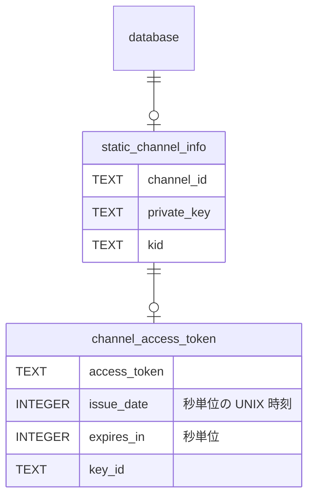

# Common

## Database

```mermaid
erDiagram

database ||--o| static_channel_info : ""
static_channel_info ||--o| channel_access_token : ""

static_channel_info {
    TEXT channel_id
    TEXT private_key
    TEXT kid
}

channel_access_token {
    TEXT access_token
    INTEGER issue_date "秒単位の UNIX 時刻"
    INTEGER expires_in "秒単位"
    TEXT key_id
}
```
