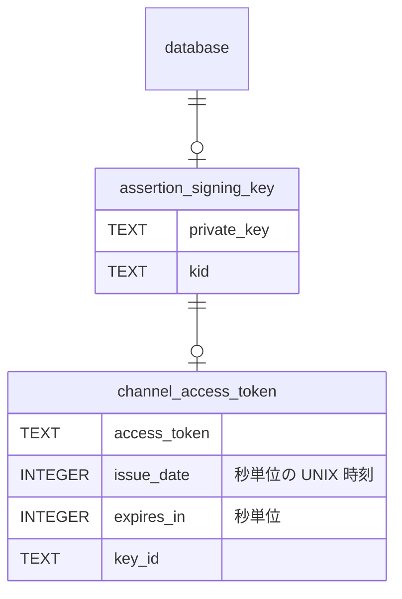

# Common

## Database

```mermaid
erDiagram

database ||--o| assertion_signing_key : ""
assertion_signing_key ||--o| channel_access_token : ""

assertion_signing_key {
    TEXT private_key
    TEXT kid
}

channel_access_token {
    TEXT access_token
    INTEGER issue_date "秒単位の UNIX 時刻"
    INTEGER expires_in "秒単位"
    TEXT key_id
}
```
